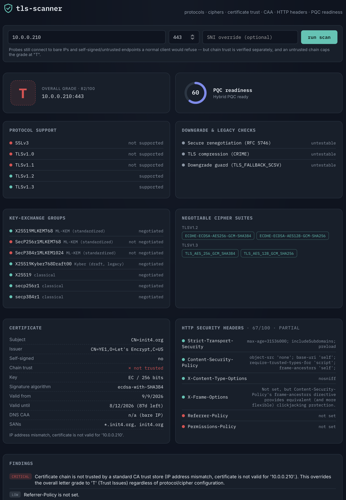

# TLS / PQC Readiness Scanner

A self-hosted tool for auditing a host's TLS posture: protocol versions,
cipher suites, certificate trust, post-quantum hybrid key-exchange
readiness, DNS CAA, and HTTP security headers. Built to point at bare IPs,
internal hostnames, and self-signed/untrusted endpoints -- the kind of thing
a normal browser or HTTP client would refuse to talk to.

- **Backend**: FastAPI (Python), REST API, JSON responses only.
- **Frontend**: React + Vite single-page app, calls the backend over `/api`.
- **Containers**: Podman-first, but works out of the box with Docker too.

**→ See [INSTALL.md](INSTALL.md) for setup (Podman or Docker, compose or
plain), the full API reference, and a detailed explanation of every check.**

## What it checks

- **Protocols**: TLS 1.0 through 1.3, plus SSLv3 and three extension-level
  downgrade checks (secure renegotiation, TLS compression, `TLS_FALLBACK_SCSV`)
  that no longer have any API in a normal TLS stack at all -- tested by
  hand-building the handshake bytes directly over a raw socket.
- **Cipher suites**: strength, forward secrecy, and AEAD support across
  every negotiable TLS 1.0-1.3 suite.
- **Certificates**: expiry, key size, signature algorithm, self-signed
  status, *and* a real independent chain-trust check against the system CA
  store -- an untrusted chain caps the letter grade at `T` (Trust Issues, the
  same convention Qualys SSL Labs uses), regardless of how clean everything
  else is.
- **Post-quantum readiness**: final ML-KEM hybrid groups and the
  pre-standard draft Kyber hybrid, reported as its own score separate from
  the main grade (almost no server negotiates one today).
- **DNS CAA** (RFC 8659), including the parent-domain tree-walk.
- **HTTP security headers**: HSTS, CSP, `X-Content-Type-Options`,
  `X-Frame-Options`, `Referrer-Policy`, `Permissions-Policy`.

## Screenshot



## Example output

Abbreviated `POST /api/scan` response for `example.com` (some arrays
trimmed for length -- see [INSTALL.md](INSTALL.md#api-reference) for the
full field reference):

```json
{
  "target": {
    "host": "example.com",
    "port": 443,
    "sni": "example.com",
    "resolved_ip": "104.20.23.154"
  },
  "scanned_at": "2026-09-13T23:01:05.012832+00:00",
  "duration_ms": 85,
  "openssl_version": "OpenSSL 3.5.0 8 Apr 2025 (Library: OpenSSL 3.5.0 8 Apr 2025)",
  "protocols": [
    { "name": "SSLv3", "supported": false, "tested": true,
      "note": "Connection closed without responding to the SSLv3 ClientHello." },
    { "name": "TLSv1.0", "supported": true, "tested": true, "note": null },
    { "name": "TLSv1.2", "supported": true, "tested": true, "note": null },
    { "name": "TLSv1.3", "supported": true, "tested": true, "note": null }
  ],
  "ciphers": [
    { "name": "ECDHE-ECDSA-AES256-GCM-SHA384", "protocol": "TLSv1.2", "supported": true,
      "strength": "strong", "forward_secrecy": true, "aead": true },
    { "name": "AES128-SHA", "protocol": "TLSv1.2", "supported": true,
      "strength": "weak", "forward_secrecy": false, "aead": false },
    { "name": "RC4-MD5", "protocol": "TLSv1.2", "supported": false,
      "strength": "insecure", "forward_secrecy": false, "aead": false },
    { "name": "TLS_AES_256_GCM_SHA384", "protocol": "TLSv1.3", "supported": true,
      "strength": "strong", "forward_secrecy": true, "aead": true }
  ],
  "key_exchange_groups": [
    { "name": "X25519MLKEM768", "kind": "hybrid-final", "supported": true, "note": null },
    { "name": "SecP256r1MLKEM768", "kind": "hybrid-final", "supported": false,
      "note": "handshake did not complete with this group offered" },
    { "name": "X25519Kyber768Draft00", "kind": "hybrid-draft", "supported": true,
      "note": "Server requested this exact group via a HelloRetryRequest (RFC 8446) -- confirms group-level support without completing a full key exchange." },
    { "name": "X25519", "kind": "classical", "supported": true, "note": null }
  ],
  "legacy_checks": [
    { "name": "secure_renegotiation", "supported": true,
      "note": "Server echoed the renegotiation_info extension (RFC 5746)." },
    { "name": "tls_compression", "supported": false,
      "note": "Server did not select TLS compression." },
    { "name": "fallback_scsv", "supported": null,
      "note": "Could not determine (connection closed without responding) -- most likely this probe's ClientHello doesn't match anything the server is willing to negotiate (e.g. a TLS-1.3-only server)." }
  ],
  "certificate": {
    "subject": "CN=example.com",
    "issuer": "CN=Cloudflare TLS Issuing ECC CA 3,O=SSL Corporation,C=US",
    "self_signed": false,
    "not_before": "2026-07-29T22:10:08+00:00",
    "not_after": "2026-10-27T22:17:21+00:00",
    "days_until_expiry": 43,
    "expired": false,
    "key_type": "EC",
    "key_bits": 256,
    "signature_algorithm": "ecdsa-with-SHA256",
    "sans": ["example.com", "*.example.com"],
    "trust_note": "This leaf certificate was read over a connection that skips chain verification by design; see 'Chain trust' for the independently verified result.",
    "chain_trusted": true,
    "chain_trust_note": "Verified against the system CA trust store."
  },
  "dns_caa": { "applicable": true, "records": [], "found_at": null, "note": null },
  "http_security_headers": {
    "checked": true,
    "status_code": 200,
    "headers": [
      { "header": "Strict-Transport-Security", "present": false, "value": null, "note": null },
      { "header": "Content-Security-Policy", "present": false, "value": null, "note": null }
    ],
    "note": null
  },
  "scoring": {
    "protocol_score": 55,
    "cipher_score": 52,
    "certificate_score": 95,
    "overall_score": 64,
    "overall_grade": "C",
    "pqc_readiness_score": 60,
    "pqc_readiness_label": "Hybrid PQC ready",
    "http_headers_score": 0,
    "http_headers_label": "None set",
    "findings": [
      { "severity": "high", "message": "TLS 1.0 is supported. Deprecated by all major browsers and PCI-DSS; disable it." },
      { "severity": "medium", "message": "Weak cipher suite negotiable: AES256-GCM-SHA384 (TLSv1.2) -- no forward secrecy or AEAD." },
      { "severity": "info", "message": "Certificate chain is verified and trusted by a standard CA trust store." },
      { "severity": "low", "message": "No DNS CAA record found -- any publicly trusted CA can issue certificates for this domain. Adding one limits mis-issuance risk." },
      { "severity": "info", "message": "Server negotiates 1 standardized ML-KEM hybrid group(s): X25519MLKEM768." },
      { "severity": "medium", "message": "Strict-Transport-Security is not set." }
    ]
  },
  "errors": []
}
```
